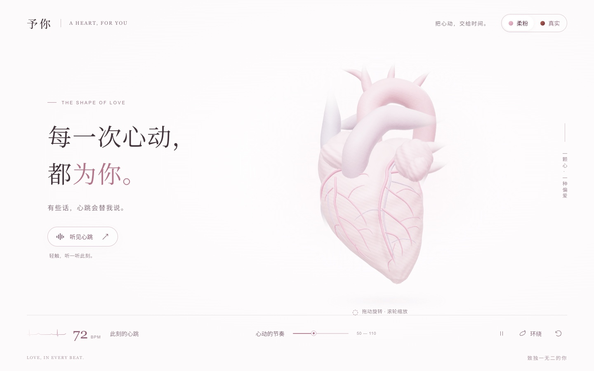
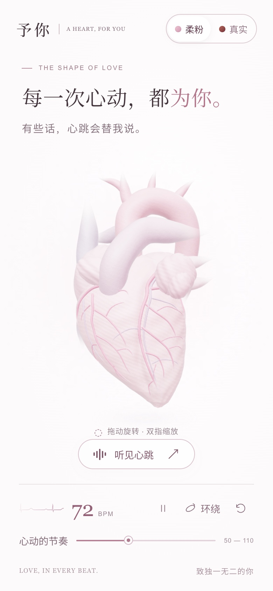
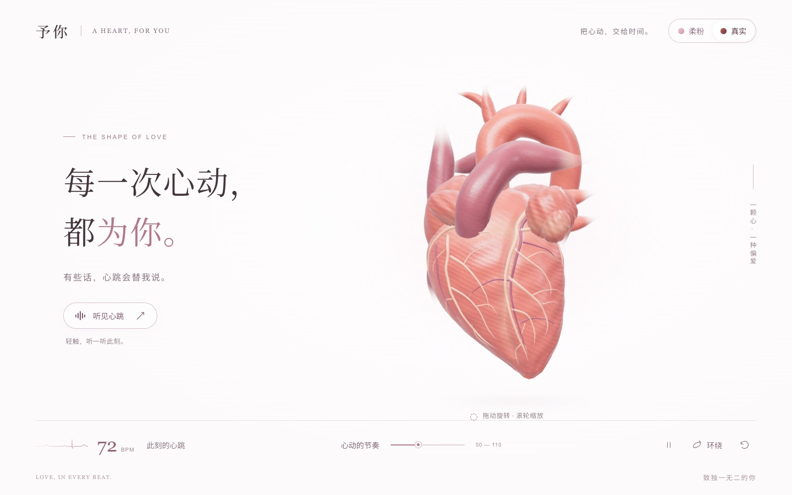
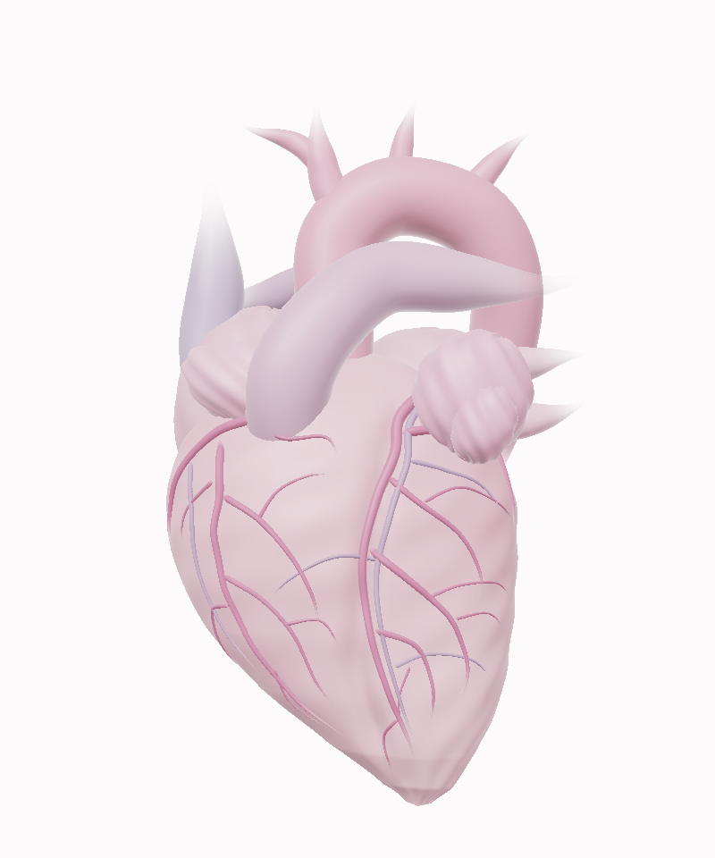
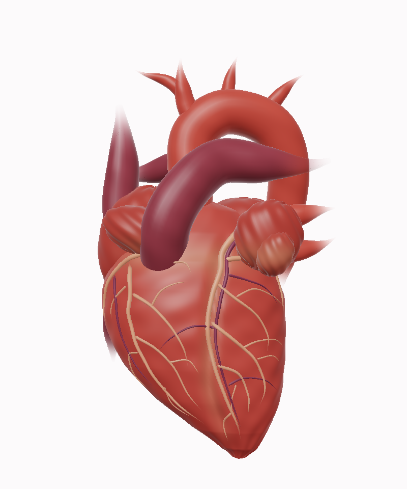

# 予你 · A heart, for you

**一颗真实形态的心脏，一段只为你存在的心跳。**

原创 Three.js 程序化人体心脏 · 单文件离线运行 · 心音由代码实时合成

[**▶ 在线体验**](https://yyh-0428.github.io/YuNi-3D-Heart/)　·　[源码](https://github.com/yyh-0428/YuNi-3D-Heart)　·　[问题反馈](https://github.com/yyh-0428/YuNi-3D-Heart/issues)

`v1.2.0`　·　`WebGL 2`　·　`825 KiB 单文件`　·　`零外部依赖`

[](https://yyh-0428.github.io/YuNi-3D-Heart/)

---

## 这是什么

一颗在浏览器里跳动的心脏。

它的模型不是下载来的，而是用 Three.js 的几何代码**从零长出来的**：心室是一张不对称参数曲面，心房与心耳独立塑形，主动脉弓、肺动脉与腔静脉由带半径变化的空间曲线生成，冠状血管贴合真实的心肌曲面。约 **10 万个顶点、18.8 万个三角面**，合并为 5 个网格。

它跟着心动周期一起呼吸 —— 局部径向收缩、纵向缩短、心尖与基底之间轻微扭转，接着快速解扭、舒张、缓慢充盈。心跳声也不是录音，而是 Web Audio 现场合成的两组短促共振：第一心音低沉稍长，第二心音更短更轻。

页面很安静。淡玫瑰色，大量留白，一句话，和一颗心。

> 这是一件**爱情主题的艺术作品**，参考人体解剖的外形关系制作，不是医学扫描重建，也不是临床仿真。

## 在线体验

打开 **<https://yyh-0428.github.io/YuNi-3D-Heart/>** 即可，手机上也一样。

也可以解压后直接双击根目录的 **`index.html`** —— 它就是完整的单文件版本：Three.js、代码、样式、中文字形全部内嵌，**不联网也能跑**。

> 初次打开是**静音**的。点一下「听见心跳」，它才开始出声 —— 不会突然吓到你。

<p align="center">
  
</p>

## 你可以怎么玩

| 操作 | 效果 |
| --- | --- |
| 拖动心脏 | 旋转观察，包括完整的背面 |
| 滚轮 / 双指捏合 | 缩放 |
| 右上角「柔粉 / 真实」 | 切换两种心脏配色 |
| 「听见心跳」 | 开 / 关心跳声 |
| 「心动的节奏」滑块 | 在 50–110 BPM 之间调整，默认 72 |
| 暂停按钮 | 同时暂停形变与心跳声 |
| 「环绕」 | 缓慢自动旋转 |
| 复位按钮 / 双击模型 | 回到正面视角 |
| 方向键 · `+` `-` · `Home` | 聚焦模型后旋转、缩放、复位 |

鼠标、触摸、键盘都支持。切换配色不会打断心跳，也不会重置心率或视角。

## 两种配色

| 柔粉（默认） | 真实 |
| --- | --- |
| [](docs/screenshot-desktop.jpg) | [](docs/screenshot-natural.jpg) |
| 淡玫瑰色的艺术处理，安静、柔和 | 深红心肌、较暗的静脉、柔和的组织色差 |

浏览器允许时，你的选择会被记住。

## 它为什么这么"轻"

整个作品就是**一个 825 KiB 的 HTML 文件**。拷进 U 盘、拔掉网线、双击，它照样跳。

- **没有 CDN**，没有网络字体，没有外部模型，没有录音，没有后端
- Three.js 0.180.0 与所需附加工具已内嵌在 `vendor/`
- 中文字形（衬线 + 无衬线）以 base64 内嵌，不依赖系统字体
- 心跳声由 Web Audio 在本机实时合成 —— **没有采集任何人的生物数据**

## 心跳是怎么对齐的

动画、示意心电曲线和心音共享同一个时钟。

开启声音后，画面通过 `AudioContext.getOutputTimestamp()` 对齐到**正在输出**的音频帧，而不是提前渲染的音频位置；拿不到有效时间戳时，退回 `baseLatency + outputLatency` 估计。心音在音频线程上提前成对安排：第一声对应收缩开始，第二声对应舒张开始。

调心率、暂停、恢复、切回页面都会重新同步。暂停与关闭声音带 18 ms 短淡出；恢复时从下一个完整的节拍入拍，视觉相位保持连续。

> 浏览器或系统未报告的设备延迟、蓝牙额外缓冲与显示刷新率仍可能带来误差 —— 本项目没有测量具体设备的实际延迟。

## 模型细节

| 舒张相 | 收缩相 |
| --- | --- |
|  |  |

上面两张是由本工程几何数据直接得到的**静态软件渲染预览**（不是页面截图），用于观察心肌曲面、血管走向与收缩形变的形状本身。

## 目录结构

```text
YuNi-3D-Heart/
  index.html                  可独立运行的离线单文件（构建产物）
  README.md                   使用与修改说明
  package.json
  package-lock.json           固定第三方依赖版本
  src/
    template.html             页面结构与文案模板
    styles.css                电脑 / 平板 / 手机布局、粉白主题
    geometry.js               原创心肌曲面、心耳、渐变管状几何
    heart.js                  主动脉弓、肺动脉、腔静脉与冠状血管布局
    materials.js              组织微纹理、柔和边缘、共同形变着色器
    cycle.js                  分阶段心动周期及共享心音时间点
    audio.js                  心跳时钟、S1 / S2 声音合成与调度
    main.js                   场景、光照、旋转缩放、控件与响应逻辑
  vendor/
    three-runtime.min.js      已内置 Three.js 0.180.0 与所需附加工具
    three-entry.js            第三方运行库打包入口
    serif.woff2               页面用到的衬线中文字形
    sans.woff2                页面用到的无衬线中文字形
  scripts/
    build.mjs                 无需 npm 安装的离线构建
    check.mjs                 几何、音频、单文件语法和依赖检查
    check-audio.mjs           音色缓冲、输出延迟与播放状态模拟检查
    serve.mjs                 可选本地静态服务
    update-vendor.mjs         开发者更新第三方运行库时使用
  docs/
    screenshot-desktop.jpg    页面实拍 · 桌面 · 柔粉
    screenshot-natural.jpg    页面实拍 · 桌面 · 真实
    screenshot-mobile.jpg     页面实拍 · 手机 · 柔粉
    model-preview.png         舒张相几何预览
    model-natural.png         真实配色几何预览
    model-systole.png         收缩相几何预览
    VALIDATION.md             已完成检查与验证边界
  licenses/                   Three.js 和字体许可证原文
  THIRD_PARTY_NOTICES.md      第三方组件与解剖外观参考
```

## 本地运行、修改与构建

**只是想看** —— 浏览器打开 `index.html` 就够了。

**想改代码** —— 需要 Node.js 18 或更高版本，**不需要安装任何 npm 依赖**：

```bash
node scripts/build.mjs    # 重新构建 → 根目录 index.html 与 dist/index.html
node scripts/check.mjs    # 几何 / 音频 / 单文件语法与依赖检查
```

改 `src/` 下的源码，然后重新构建即可。不要直接修改压缩过的第三方库。

**起本地服务**（可选）：

```bash
node scripts/serve.mjs    # → http://localhost:4173
```

同一局域网内的手机可以访问「电脑 IP:4173」，能否连通取决于网络与防火墙设置。

**只有需要升级 Three.js 本身时**，才需要联网安装打包依赖：

```bash
npm ci
npm run vendor:update
npm run build
```

## 兼容性

- 需要支持 **WebGL 2** 与 **Web Audio** 的浏览器（近几年的 Chrome / Edge / Safari / Firefox 均可）
- 系统开启「减少动态效果」时，页面会**初始暂停**，可以手动让它开始跳动
- 手机请用能执行 JavaScript 的浏览器打开。文件管理器里的静态预览不等于网页运行；若手机不支持直接打开本地 HTML，把 `index.html` 放到任意静态网页服务上即可

## 验证状态

**代码层**（`node scripts/check.mjs`，可复现）：

- 单文件 JavaScript 语法、内嵌资源、几何属性与音频缓冲全部通过
- 几何：5 个网格 / 100,031 顶点 / 188,232 三角面，索引合法，数值有限
- 音频：12 组音色 × 2 种心音 × 3 种采样率 = 72 个缓冲，无削波、尾部平滑
- 同步：50 / 72 / 110 BPM × 12 / 90 / 220 ms 延迟共 9 组十分钟模拟，13,914 次起音核对通过，无重复节拍、无累积漂移
- 交互：暂停 / 继续、页面隐藏 / 恢复、音频中断、快速调速与快速开关声音均通过

**浏览器实测**（Chrome，1440×900 桌面 / 390×844 手机 / 320×568 窄屏）：

- 三档均为 **0 个未捕获异常、0 个控制台错误、0 个失败请求**
- 无横向溢出，WebGL 2 正常，画布正确铺满
- 拖动旋转、配色切换、心跳声开关实测可用

**尚未覆盖**：真机音频试听、实际设备上的音画延迟、长时间帧率表现。页面实拍见 `docs/screenshot-*.jpg`；`docs/model-*.png` 为几何软件渲染预览，不作为浏览器效果或设备兼容性的证明。不同浏览器的 WebGL 与音频策略仍建议在最终使用设备上确认。

## 许可与第三方

| 组件 | 许可证 |
| --- | --- |
| Three.js 0.180.0 | MIT |
| Noto Sans SC / Noto Serif SC 字形 | SIL Open Font License 1.1 |

许可证原文见 `licenses/`，第三方组件与解剖外观参考说明见 `THIRD_PARTY_NOTICES.md`。作品自身的授权方式尚未在仓库中声明。

---

<p align="center"><sub>LOVE, IN EVERY BEAT.　致独一无二的你</sub></p>
